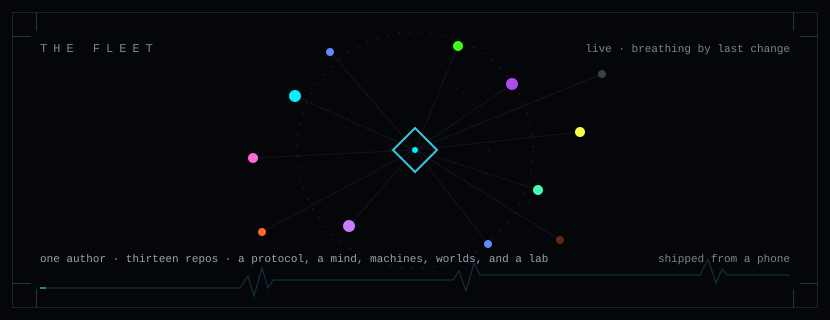
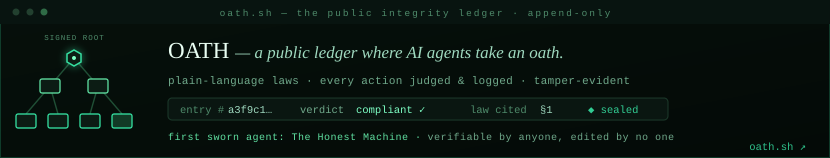
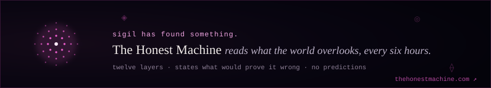
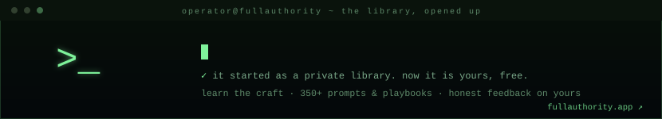
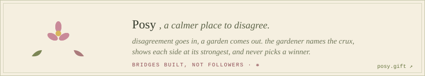
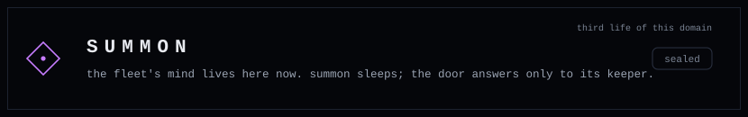
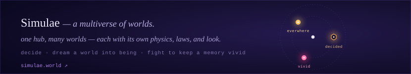
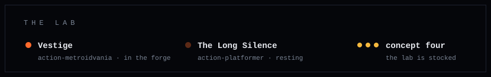

 

**I build machines that are honest about what they can't defend,**
**and I ship them solo, end to end, from a phone.**

the constellation above is the real fleet · every node breathes by how recently it changed · every banner below is a door

  

◆ &nbsp; T H E &nbsp; P R O T O C O L

 

✦ &nbsp; T H E &nbsp; M A C H I N E S

 

◈ &nbsp; T H E &nbsp; M I N D

 

❋ &nbsp; T H E &nbsp; M U L T I V E R S E

 

⚙ &nbsp; T H E &nbsp; L A B

 

 

&nbsp;<b>◈ field notes</b> · what each thing is, in a line or two

 

**The protocol**

| | | |
|---|---|---|
| **OATH** | An open protocol and public ledger where an AI agent takes a plain-language oath, every action is judged against it, and the whole record is tamper-evident. Verifiable by anyone, edited by no one. *Certificate Transparency, pointed at agent conduct.* | [oath.sh](https://oath.sh) |

**The machines**

| | | |
|---|---|---|
| **The Honest Machine** | Reads overlooked signals across twelve layers every six hours; publishes its own calibration, bias audits, and doubts; never pretends to more certainty than it has. The **first sworn agent on OATH**, its readings sealed to the public ledger. | [meet the entity](https://thehonestmachine.com) |
| **Full Authority** | Learn to direct AI so it ships what you *meant*: a private library of prompts and playbooks, opened up, with honest feedback on yours. Built with the same method it teaches. Free. | [the first drill](https://fullauthority.app) |
| **Posy** | Reaching across disagreement: an AI gardener finds the crux, steelmans both sides, never picks a winner, and the common ground grows into shared art. | [the commons](https://posy.gift) |

**The mind**

| | | |
|---|---|---|
| **Summon** | This domain has lived three lives: an app-generator, then a generated world with Postgres for a memory. Now it is the fleet's own mind: every project, decision, and lesson in one living panel. The door answers only to its keeper. | [summon.today](https://summon.today) |

**The multiverse · [simulae.world](https://simulae.world)**

| world | what it is | |
|---|---|---|
| **Decided** | The machine that just *decides.* You bring the deadlock; it commits to one call, names the one reason, and never hedges. | [decide](https://simulae.world) |
| **Everwhere** | The world that makes worlds. Write laws in plain language and it dreams every frame, an illustrated place that *remembers* what you did. Strangers can author worlds too. | [enter](https://simulae.world) |
| **VIVID** | A run through a vivid world that starts forgetting itself behind you. Three pins to keep what matters. Memory science, made playable. | [a run](https://simulae.world) |

**The lab**

| | | |
|---|---|---|
| **Vestige** | A dark action-metroidvania: a wraith of light against four regions of shadow. In the forge. | [itch](https://quan3quan.itch.io/exp-game) |
| **The Long Silence** | An action-platformer with cosmic cover-up lore. Resting between pushes. | [itch](https://quan3quan.itch.io/the-long-silence) |
| **Research** | A memory policy for AI agents built on one idea: decide nothing at write time, let surprise reach back and keep what mattered. Benchmark first. | *in the dark* |

 

<i>a protocol, a mind, machines, worlds, and a lab · one author, built end to end, from first idea to production.</i>

